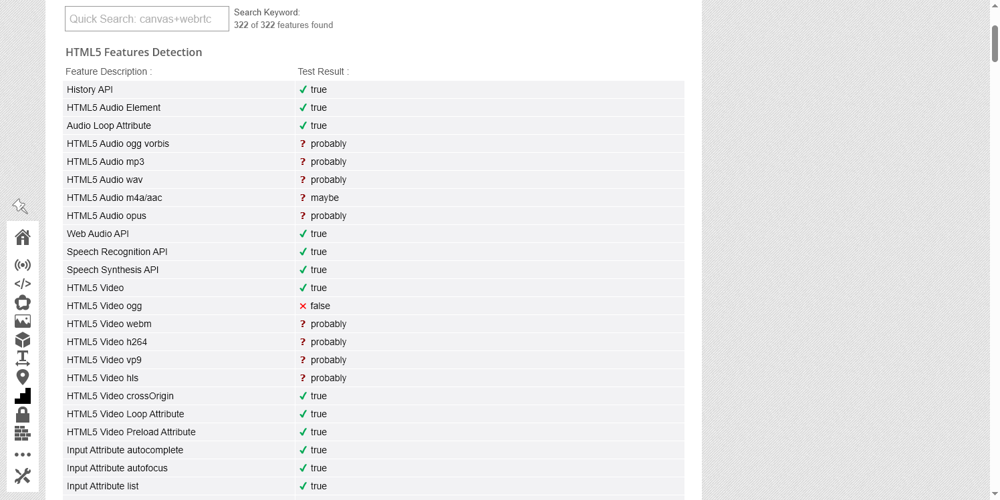

# Browser3 public validation — local report

**Status:** Complete local validation report. Do not publish without explicit owner
approval.

**Product / Chromium version:** 149.0.7827.201

**Test date:** 2026-08-15

**Build:** Release, product and file version 149.0.7827.201

**Environment:** One physical AMD64 host running Windows 10 build 19041, Czech operating
system locale, five persistent Browser3 profiles, no proxy. Exact hardware details and
local identity data are retained only in the private evidence.

## What this report measures

This report separates three questions:

1. **Same-profile stability:** whether the same profile keeps its selected identity
   signals across a page reload, a close/reopen cycle, and a new browser process.
2. **Cross-profile diversity:** whether the five profiles expose distinct identity
   combinations while remaining stable individually.
3. **Native reference difference:** how the five Browser3 profiles compare with the same
   Chromium build launched without Browser3 profile configuration.

The private release harness records the detailed evidence. The public report contains
only sanitized counts and aggregates from public third-party test sites. It excludes raw
responses, local profile data, identifiers, network addresses, exact internal
heuristics, and detector research.

No single third-party site is treated as an absolute verdict. Its output is interpreted
only for the question that site measures, and service availability or model changes may
alter results without a Browser3 code change.

## Method

- Five profiles were tested with the Release build through a CDP-free browser workflow.
- Fingerprint.com Playground was loaded twice per profile with a fresh document between
  loads. Request-level browser identity headers and selected stable identity signals were
  compared privately.
- Separate close/reopen and browser-process restart phases are required before a public
  persistence claim can pass.
- A stock/native reference uses the same local Chromium executable without Browser3
  profile configuration and without a proxy.
- Public cross-checks include Fingerprint.com Playground, Pixelscan, OverpoweredJS,
  CreepJS, and BrowserLeaks when each service can be captured successfully.

## Sanitized results from 2026-08-15

### Same-profile stability

| Check | Result | Scope |
|---|---:|---|
| Reload signal stability | 15/15 | Five profiles in each of three process cycles; selected request headers and stable identity signals matched between the two loads. |
| Fingerprint.com visitor continuity across reload | 15/15 | Count only; identifiers are not retained in this public report. |
| Close and reopen | 5/5 | The selected same-profile signals matched the initial process cycle. |
| New browser-process restart | 5/5 | The selected same-profile signals matched after a second full process cycle. |

### Cross-profile diversity

The private comparison found five distinct profile signatures out of five profiles in
each of the `initial`, `reopen`, and `restart` cycles. Every profile remained stable under
the same private comparison. Raw combinations and the exact comparison rule remain
private. This is evidence of separation for this run, not proof that every external
service will treat the profiles as unrelated. Hardware-policy reconciliation remains an
open limitation and is not presented as a success claim.

### External public tests

| Public service | Sanitized observation | Interpretation |
|---|---|---|
| Fingerprint.com Playground | Across the three five-profile cycles, tampering model averages ranged from 0.0283 to 0.0335 (5/5 per cycle); virtual-machine model averages ranged from 0.0580 to 0.0600 (5/5 per cycle). The optional VPN model was unavailable. | Required tampering and virtual-machine coverage was complete. VPN is outside the required release gate. These values are observations, not bypass guarantees. |
| Pixelscan | Navigator, webdriver and CDP checks were clear on 15/15 samples; the user-agent check was not clear on 0/15. | Mixed result; no overall pass claim. |
| OverpoweredJS | Automated collection returned an error on 15/15 samples. | No conclusion. A successful repeat is required. |
| CreepJS | A red warning was reported on 15/15 samples. | No overall pass claim; warning context requires manual review. |
| BrowserLeaks | The Features Detection page was captured successfully for 5/5 profiles. The visible table reported 322 of 322 features found in each reviewed viewport. | This documents page availability and a general feature table only. It is not a detector verdict or proof of bypass. Raw feature hashes were deliberately excluded. |

Historical per-machine reference averages were 0.1053 for the tampering model and 0.0466
for the virtual-machine model (five profiles). Both required models returned data for all
five profiles in every lifecycle phase.

A fresh native reference in the same versioned run reported tampering 0.0961 and
virtual-machine 0.0470. The native measurement is a reference difference, not a target
score and not a bypass verdict.

## Screenshots and evidence boundary

A representative BrowserLeaks Features Detection screenshot from the five-profile capture
passed manual visual review. The viewport was captured after the raw Features Hash had
been scrolled out of view; it contains no account data, visitor identifier, network or
location data, proxy detail, profile name, or browser UI history. Its SHA-256 is
`55822582dc92c36fa4a6cf14d7aa3583360e1e33d8b2a163eda281fd1f7bf1a5`.

The five original per-profile screenshots and capture metadata remain private. The
public image is a representative service screenshot, not an aggregate result and not a
claim that BrowserLeaks validates Browser3.

Private evidence is stored locally under the versioned internal results directory and is
not part of the public source snapshot. This document intentionally provides no path to
that private material.

## Known limitations

- The measured GPU identity combinations require reconciliation with the current
  host-bound hardware policy before they can support a public coherence claim.
- Testing covers one Windows host and one network context; it does not establish behavior
  across hardware classes, networks, countries, or future detector versions.
- OverpoweredJS did not return usable automated evidence.
- CreepJS and Pixelscan returned mixed results described above.
- Third-party services and model outputs can change independently of Browser3.
- The report does not claim that Browser3 is “undetectable” and does not guarantee an
  anti-bot or fingerprinting bypass.

## Reproduction and publication gate

Use Browser3 149.0.7827.201 on Windows with five persistent profiles. Repeat the named
public test sites for every profile, repeat Fingerprint.com after a fresh-document reload,
then close and reopen each profile and restart the browser process. Capture a same-run
native reference. Report missing data as missing; do not substitute or estimate it.

Publication requires all of the following: a complete five-profile run, a fresh native
control, successful privacy and secret scans, manual screenshot review, fact-checking
against retained evidence, and explicit owner approval. This local report does not grant
publication permission by itself.
